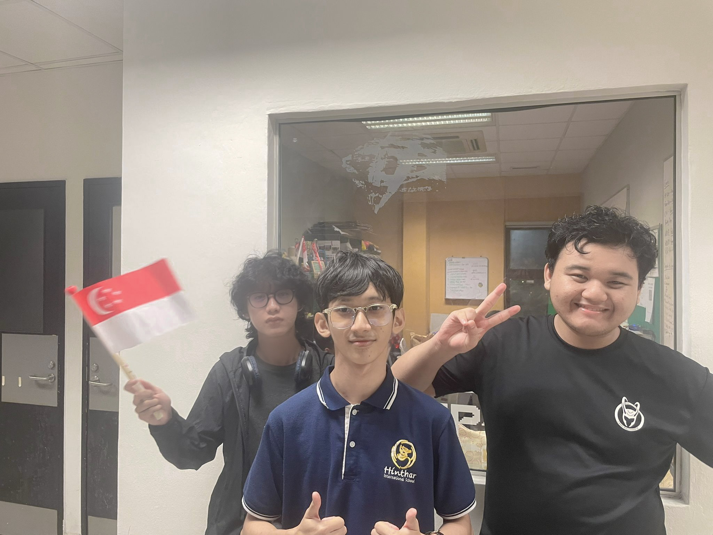

# WRO_Differential

## Future Engineer attempt by SP Team Differential

We are Students from Robotics Innovation & Technology club from Singapore Polythenics. Our team consist of three members: Zeliks , Lucas and Benedict. We create our team on 4th June  2024 after our club's Annual General Meeting. In that meeting, we found out about this competitions. Let's get into the contents of our robot. 

### Team Photo

***Conponents we using in our robots***

*	**TB6612FNG motor driver**
*	**Differential Gear**
*	**180 servo for steering**
*	**Gear motor**
*	**Breadboard** 
*	**2 x 8 cm diameter back wheel** 
*	**2 x 5 cm diameter front wheel**
*	**Asus Webcam C3** 
*	**4 x ultrasonics sensors**
*	**9v Battery**

### Steering 

For steering, we use principles of Ackerman Steering Mechanism. The steering is connected by Tie Rod which make two wheels turn at different angles. So, it make possible for two wheels rotates at different speed which make turning smoother and accurate cornering. This method ensures that the wheels follow the ideal turning path where each obstacle are close to each other.

### Servo

The servo is integrated with a camera-based color detection module that identifies specific colors and adjusts the robot’s direction accordingly. It serveas as main role of our robots. Servo will steer the robots not to crash into wall or obstacle. When camera detact the red, it will signal the servo to turn at maximum degree to right and for green, it will turn to left and guiding the robots through the best path.

### Motor at Rear

We use TB6612FNG motor driver to run the motor. The TB6612FNG motor driver provides precise control over the motor, regulating speed and direction. It is capable of driving the motor with high efficiency and accuracy, ensuring that the differential gear system operates optimally. It can adjust the speed according to respond to different conditions. The motor driver also includes built-in protections such as thermal shutdown, overcurrent protection, and undervoltage lockout, which safeguard the motor and the overall system during operation.
